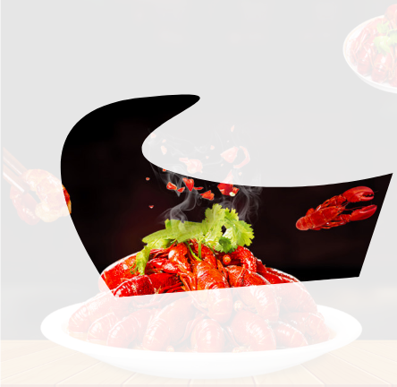
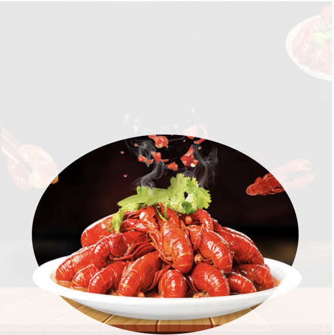
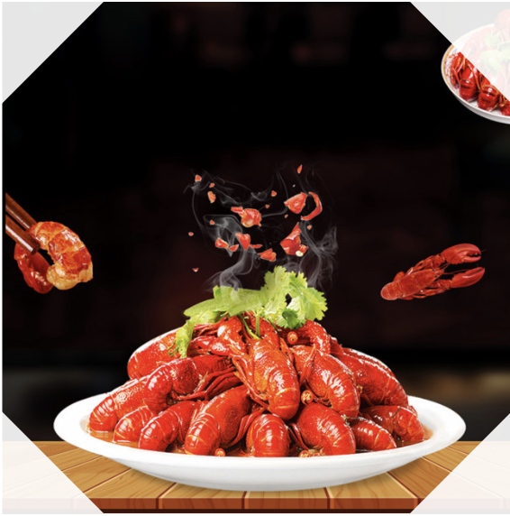

# CSS中的图像处理 —— clip-path

[原文链接](https://xiaotianxia.github.io/blog/vuepress/css/clip_path.html?_=3566625361256782357)

## 前言
Photoshop中用钢笔工具勾出轮廓，转为选取，然后反选，删去多余部分，最后只留下要选择的区域，
这一波操作想必是懂PS都非常熟悉的了，就像这样：


在CSS3中也有思思功能的属性：clip-path。顾名思义：裁剪路径，
该属性可以将方方正正的元素裁剪成几乎任何你想要的形状。

今天就跟大家一块学习这一操作。

有一个在线[神器](http://bennettfeely.com/clippy)，学习之前先体验一下这个特性吧。

## 基本语法
```js
clip-path: <clip-source> | [ <basic-shape> || <geometry-box> ] | none

where:
<clip-source> = <url>
<basic-shape> = <inset()> | <circle()> | <ellipse()> | <polygon()>
<geometry-box> = <shape-box> | fill-box | stroke-box | view-box

where:
<url> = svg引用
<inset()> = inset( <length-percentage>{1,4} [ round <border-radius> ]? )
<circle()> = circle( [ <shape-radius> ]? [ at <position> ]? )
<ellipse()> = ellipse( [ <shape-radius>{2} ]? [ at <position> ]? )
<polygon()> = polygon( <fill-rule>? , [ <length-percentage> <length-percentage> ]# )
<shape-box> = <box> | margin-box

where:
<length-percentage> = <length> | <percentage>
<shape-radius> = <length-percentage> | closest-side | farthest-side
<position> = [ [ left | center | right ] || [ top | center | bottom ] | [ left | center | right | <length-percentage> ] [ top | center | bottom | <length-percentage> ]? | [ [ left | right ] <length-percentage> ] && [ [ top | bottom ] <length-percentage> ] ]
<fill-rule> = nonzero | evenodd
<box> = border-box | padding-box | content-box
```
艾玛，看着是不是眼花缭乱的....下面就试着通过demo展开学一下~

::: warning 提示
Demo说明：图片中的半透明是额外的元素，用来做参考的，实际的剪切效果中不会出现。
:::

### clip-source
适应于SVG，即定义了clipPath的SVG元素
```css
clip-path: url(#c1); /*可以使本页的内联SVG*/
clip-path: url(resources.svg#c1); /*还可以是远程的SVG*/
```
SVG形状灵活，可以是各种不规则图形，甚至可以是文字，像这样：



甚至这样：


可跳到demo页查看。

<spreadown>
    <iframe height='300' scrolling='no' title='svg' src='//codepen.io/_tianxia/embed/JZgWBN/?height=300&theme-id=33504&default-tab=css,result&embed-version=2' frameborder='no' allowtransparency='true' allowfullscreen='true' style='width: 100%;'>See the Pen <a href='https://codepen.io/_tianxia/pen/JZgWBN/'>svg</a> by Denzel (<a href='https://codepen.io/_tianxia'>@_tianxia</a>) on <a href='https://codepen.io'>CodePen</a>.</iframe>
    <show-in-codepen href="https://codepen.io/_tianxia/pen/JZgWBN/"></show-in-codepen>
</spreadown>

SVG不太了解以后再好好学吧，熟悉SVG同学可以多试试其他的形状。

### basic-shape

#### inset()

::: tip tip
inset() : 定义一个矩形 。注意，定义矩形不是rect，而是 inset。
:::

```css
inset( <length-percentage>{1,4} [ round <border-radius> ]? )
```
inset()可以传入5个参数，分别对应top，right，bottom，left的裁剪位置，round radius（可选，圆角），参数之间用空格隔开。


<spreadown>
    <iframe height='310' scrolling='no' title='1' src='//codepen.io/_tianxia/embed/dKxNgM/?height=310&theme-id=33504&default-tab=css,result&embed-version=2' frameborder='no' allowtransparency='true' allowfullscreen='true' style='width: 100%;'>See the Pen <a href='https://codepen.io/_tianxia/pen/dKxNgM/'>1</a> by Denzel (<a href='https://codepen.io/_tianxia'>@_tianxia</a>) on <a href='https://codepen.io'>CodePen</a>.</iframe>
    <show-in-codepen href="https://codepen.io/_tianxia/pen/dKxNgM/"></show-in-codepen>
</spreadown>


#### circle()
定义圆形

```css
circle( [ <shape-radius> ]? [ at <position> ]? )
```
circle()可以传人2个可选参数；

1. 圆的半径，默认值min(元素宽,元素高)/ 2，支持百分比

2. 圆心位置，默认为元素中心点

半径公式：如果半径使用百分比：圆的半径 = (sqrt(width^2 + height^2) / sqrt(2)) * 百分比 


<spreadown>
    <iframe height='300' scrolling='no' title='2' src='//codepen.io/_tianxia/embed/ZRgeKE/?height=300&theme-id=33504&default-tab=css,result&embed-version=2' frameborder='no' allowtransparency='true' allowfullscreen='true' style='width: 100%;'>See the Pen <a href='https://codepen.io/_tianxia/pen/ZRgeKE/'>2</a> by Denzel (<a href='https://codepen.io/_tianxia'>@_tianxia</a>) on <a href='https://codepen.io'>CodePen</a>.</iframe>
    <show-in-codepen href="https://codepen.io/_tianxia/pen/ZRgeKE/"></show-in-codepen>
</spreadown>


#### ellipse()
定义椭圆

```css
ellipse( [ <shape-radius>{2} ]? [ at <position> ]? )
```

ellipse()可以传人3个可选参数；

1. 椭圆的X轴半径，默认是宽度的一半，支持百分比

2. 椭圆的Y轴半径，默认是高度的一半，支持百分比

3. 椭圆中心位置，默认是元素的中心点


<spreadown>
    <iframe height='300' scrolling='no' title='3' src='//codepen.io/_tianxia/embed/oyKZwW/?height=300&theme-id=33504&default-tab=css,result&embed-version=2' frameborder='no' allowtransparency='true' allowfullscreen='true' style='width: 100%;'>See the Pen <a href='https://codepen.io/_tianxia/pen/oyKZwW/'>3</a> by Denzel (<a href='https://codepen.io/_tianxia'>@_tianxia</a>) on <a href='https://codepen.io'>CodePen</a>.</iframe>
    <show-in-codepen href="https://codepen.io/_tianxia/pen/oyKZwW/"></show-in-codepen>
</spreadown>


#### polygon()
定义多边形

```css
polygon( <fill-rule>? , [ <length-percentage> <length-percentage> ]# )
```

fill-rule可选，表示填充规则，用来确定该多边形的内部。可能的值有nonzero和evenodd，默认值是nonzero。
有点拓扑学的意思，详见[这里](https://www.w3.org/TR/css-masking/#the-clip-rule)。
(这个属性现在的浏览器还没支持)

后面的每对参数表示多边形的顶点坐标（X,Y），也就是连接点


<spreadown>
    <iframe height='300' scrolling='no' title='polygon' src='//codepen.io/_tianxia/embed/rKXyzV/?height=300&theme-id=33504&default-tab=css,result&embed-version=2' frameborder='no' allowtransparency='true' allowfullscreen='true' style='width: 100%;'>See the Pen <a href='https://codepen.io/_tianxia/pen/rKXyzV/'>polygon</a> by Denzel (<a href='https://codepen.io/_tianxia'>@_tianxia</a>) on <a href='https://codepen.io'>CodePen</a>.</iframe>
    <show-in-codepen href="https://codepen.io/_tianxia/pen/rKXyzV/"></show-in-codepen>
</spreadown>


### geometry-box

可选参数。此参数和basic-shape函数一起使用时，可以为basic-shape的裁剪工作提供参考盒子，其值可以使shape-box、fill、stroke或者view-box。

其中shape-box应用于HTML元素，它具有四种值：margin-box、border-box、padding-box和content-box；fill、stroke或者view-box应用于SVG。
详见[这里](https://www.w3.org/TR/css-masking/#typedef-geometry-box)

好吧。。。浏览器暂未支持:joy:。

## Demo
照着老虎画了个猫:smirk_cat:——
<ClipPath-Demo/>

::: warning 注意
根据Masking规范，鼠标事件在图形的clipped-out区域外是无效的。

因此demo中未剪切到的部分是不响应点击的。
:::

## 参考资料
- [CSS Masking Module Level 1](https://www.w3.org/TR/css-masking/#the-clip-path)
- [clip-path](https://developer.mozilla.org/en-US/docs/Web/CSS/clip-path)
- [不可思议的CSS之clip-path](https://segmentfault.com/a/1190000010936207)
- [CSS clip-path maker](http://bennettfeely.com/clippy/)
