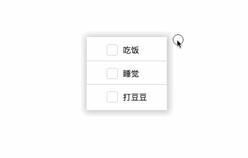

# checkbox的应用

[原文链接](https://xiaotianxia.github.io/blog/vuepress/css/use_of_checkbox.html)

## 应用一: todo list

主要代码（LESS）：

```css
input[type=checkbox] {
	display: none;
	
	&:checked ~ span {
		color: @color-gray;
		
		&:after {
			width: 100%;
		}
	}
	
	&:checked ~ label {
		&:after {
			opacity: 1;
		}
	}
}
```

demo截图


或者看这里
<show-in-codepen :href="'https://codepen.io/_tianxia/pen/NMJyMR'"></show-in-codepen>


## 应用二: 折叠菜单

### 非手风琴模式

因为checkbox是多选，可用来实现多页展开的折叠菜单

主要代码（LESS）：
```css
.section {
	text-align: center;

	input[type=checkbox] {
		display: none;
	}
	
	label {
		display: block;
		cursor: pointer;
		font-size: 1.5em;
		line-height: 2em;
		height: 2em;
		box-shadow: 1px 1px 1px 0 @color-gray;
		&:hover {
			background-color: @color-gray;
			color: #fff;
		}
	}
	
	p {
		// height: 0;
		max-height: 0;
		overflow: hidden;
		padding: 0 10px;
		line-height: 20px;
		font-size: 1em;
		transition: max-height .3s linear;
	}
	
	input[type=checkbox]:checked ~ p {
		// height: auto;
		max-height:3000px;
	}
	
	input[type=checkbox]:checked ~ label {
		box-shadow: none;
		background-color: @color-gray;
		color: #fff;
	}
}
```
demo截图


或者看这里
<show-in-codepen :href="'https://codepen.io/_tianxia/pen/ZoPMeE'"></show-in-codepen>

### 手风琴模式

因为radio是单选，可用来实现手风琴模式的折叠菜单，只需要把上面的checkbox换成radio就可以了。

主要代码（LESS）：
```css
.section {
	text-align: center;
	
	input[type=radio] {
		display: none;
	}
	
	label {
		display: block;
		cursor: pointer;
		font-size: 1.5em;
		line-height: 2em;
		height: 2em;
		box-shadow: 1px 1px 1px 0 @color-gray;
		&:hover {
			background-color: @color-gray;
			color: #fff;
		}
	}
	
	p {
		// height: 0;
		max-height: 0;
		overflow: hidden;
    	padding: 0 10px;
		line-height: 20px;
		font-size: 1em;
		transition: max-height .2s linear;
	}
	
	input[type=radio]:checked ~ p {
		// height: auto;
		max-height:3000px;
	}
	
	input[type=radio]:checked ~ label {
		box-shadow: none;
		background-color: @color-gray;
		color: #fff;
	}
}
```
demo截图


或者看这里
<show-in-codepen :href="'https://codepen.io/_tianxia/pen/vjPwmb'"></show-in-codepen>

::: warning 注意
做展开过渡效果时，一开始用的height: 0; ->height: auto;搞半天搞不出动画效果。上网查得知css3貌似本来就有这么个“规定”：大概是只有固定值之间，才能使用插帧什么的手段实现过渡动画:smile: 。
但是可以用max-height实现：max-height: 0; -> max-height: bigValue， 只要bigValue是一个大于最大auto高度的值就可以了。
当然，如果用先js计算出auto的高度再添加动画也是不错的方案，见张鑫旭老师的[文章](http://www.zhangxinxu.com/study/201501/css3-any-height-transition.html)。
:::

<!-- <comment-tool></comment-tool> -->