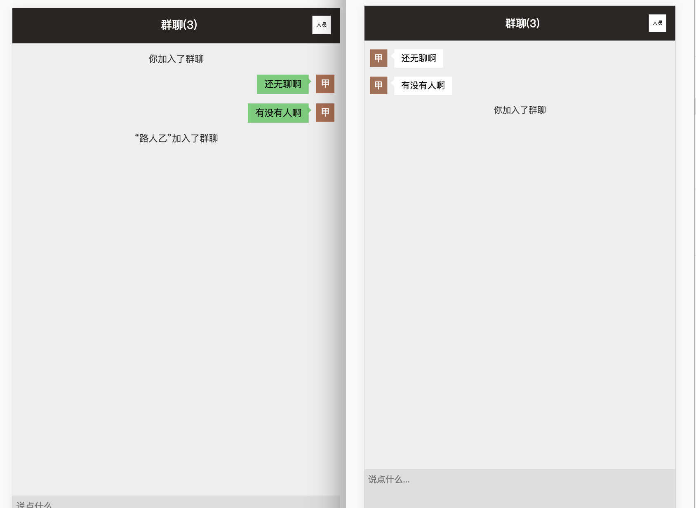
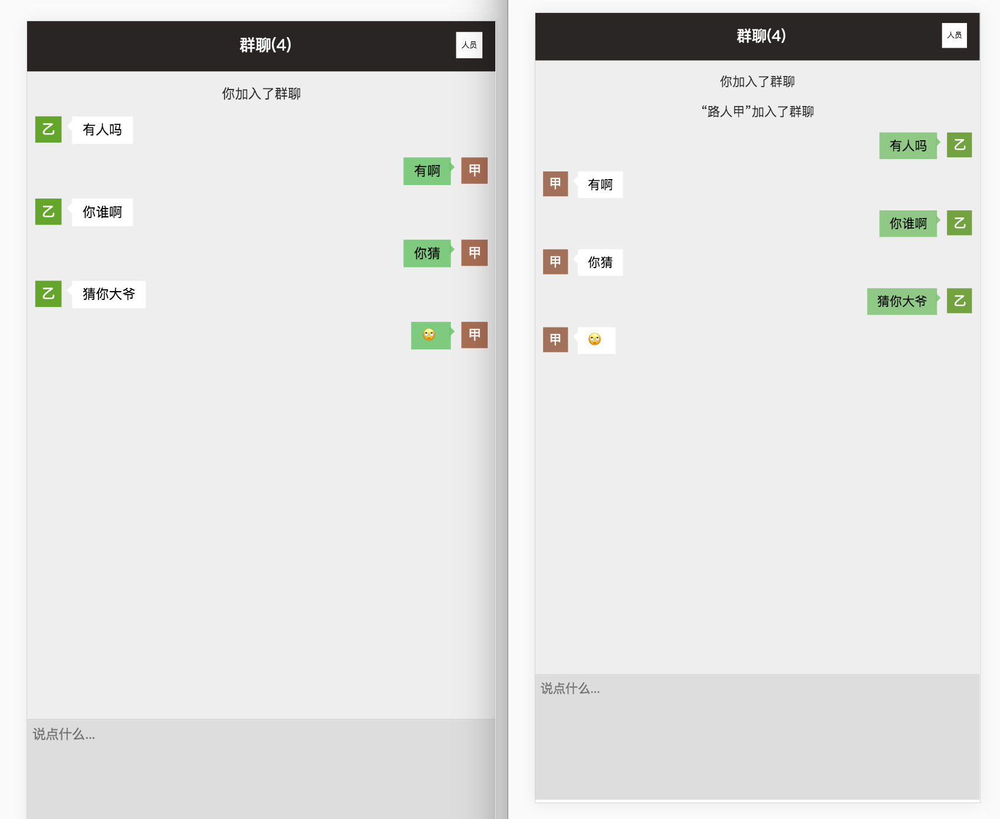
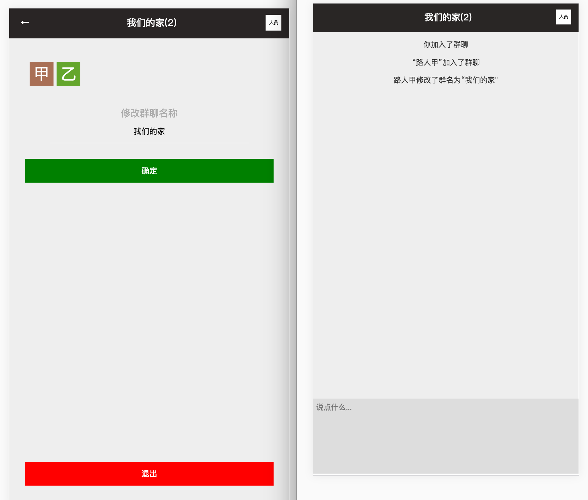
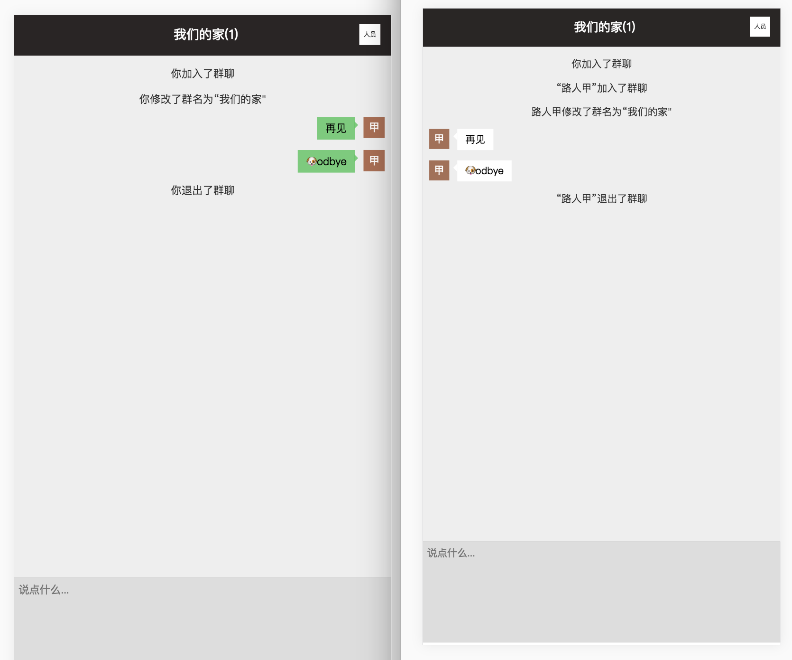

# socket.io实现简单群聊

[原文链接](https://xiaotianxia.github.io/blog/vuepress/js/simple_chatroom_using_socketio.html)

* [github地址](https://github.com/xiaotianxia/vue-chat)
### DEMO截图










### Build Setup
```bash
npm install
```

### run client
```bash
cd vue-chat
npm run dev
```

### run server
```bash
cd server
node index.js
```

### 代码片段

## server端
```js
let app = require('express')(),
    http = require('http').Server(app),
    io = require('socket.io')(http); //引入socket库

app.get('/', (req, res) => {
    res.send('<h1>welcome</h1>');
});

//维护几个全局变量，保存登录用户、用户ID等
let LOGIN_USER = {},
    USER_ID_LIST = [],
    ROOM_NAME = '',
    USER_LIST = [];
//连接socket
io.on('connection', socket => {
    //监听socket用socket.on()，发送socket用io.emit(),socket名按语义自定义字符串，只要server端和client端对应好就行
    socket.on('login', userInfo => {
        LOGIN_USER = userInfo;
        ROOM_NAME = userInfo.roomName;
        if(USER_ID_LIST.indexOf(LOGIN_USER.userId) == -1) {
            USER_ID_LIST.push(LOGIN_USER.userId);
            USER_LIST.push(userInfo);
        }
        console.log(USER_ID_LIST);
        let msg = '“' + userInfo.name + '”'+ '加入了群聊',
            userMsg = {
                name: userInfo.name,
                userId: userInfo.userId,
                type: 'system',
                msg: msg
            };
        io.emit('login', userMsg);
        io.emit('updateUserCount', {
            userCount: USER_ID_LIST.length
        });
    });

    socket.on('chat', chatMsg => {
        chatMsg.type = (chatMsg.userId == LOGIN_USER.userId ? 'self' : 'other');
        io.emit('chat', chatMsg);
    });

    socket.on('logout', (userInfo) => {
        USER_ID_LIST.splice(USER_ID_LIST.indexOf(userInfo.userId), 1);
        USER_LIST.splice(USER_ID_LIST.indexOf(userInfo.userId), 1);
        io.emit('updateUserCount', {
            userCount: USER_ID_LIST.length
        });
        console.log(USER_ID_LIST);
        let msg = '“' + userInfo.name + '”'+ '退出了群聊',
            userMsg = {
                name: userInfo.name,
                userId: userInfo.userId,
                type: 'system',
                msg: msg
            };
        io.emit('logout', userMsg);
    });

    socket.on('getRoomInfo', () => {
        io.emit('getRoomInfo', {
            roomName: ROOM_NAME,
            userList: USER_LIST
        });
    });

    socket.on('editRoomName', data => {
        ROOM_NAME = data.roomName;
        let msg = data.name + '修改了群名为' + '“' + data.roomName + '"',
            userMsg = {
                name: data.name,
                userId: data.userId,
                type: 'system',
                roomName: data.roomName,
                msg: msg
            };
        console.log(msg);
        io.emit('editRoomName', userMsg);
    });
});

//监听7000端口
http.listen(7000, () => {
    console.log('listening on : 7000');
});
```

## client端 部分代码
```js
let chatData = localStorage.getItem('chat_user');
if(chatData && chatData != '[object Object]') {
	this.userInfo = JSON.parse(chatData);
	socket.emit('login', this.userInfo);
}

socket.on('login', data => {
	if(data.userId == this.userInfo.userId) {
		this.modalShow = false;
		data.msg = '你加入了群聊';
	}
	this.onUpdateChatList(data);
});

socket.on('chat', data => {
	this.onUpdateChatList(data);
});

socket.on('updateUserCount', data => {
	this.userCount = data.userCount;
});

socket.on('logout', data => {
	if(data.userId == this.userInfo.userId) {
		this.modalShow = false;
		data.msg = '你退出了群聊';
	}
	this.onUpdateChatList(data);
});

socket.on('getRoomInfo', data => {
	this.roomInfo = data;
});

socket.on('editRoomName', data => {
	if(data.userId == this.userInfo.userId) {
		data.msg = '你修改了群名为' + '“' + data.roomName + '"';
	}
	this.roomName = data.roomName;
	this.onUpdateChatList(data);
});
```