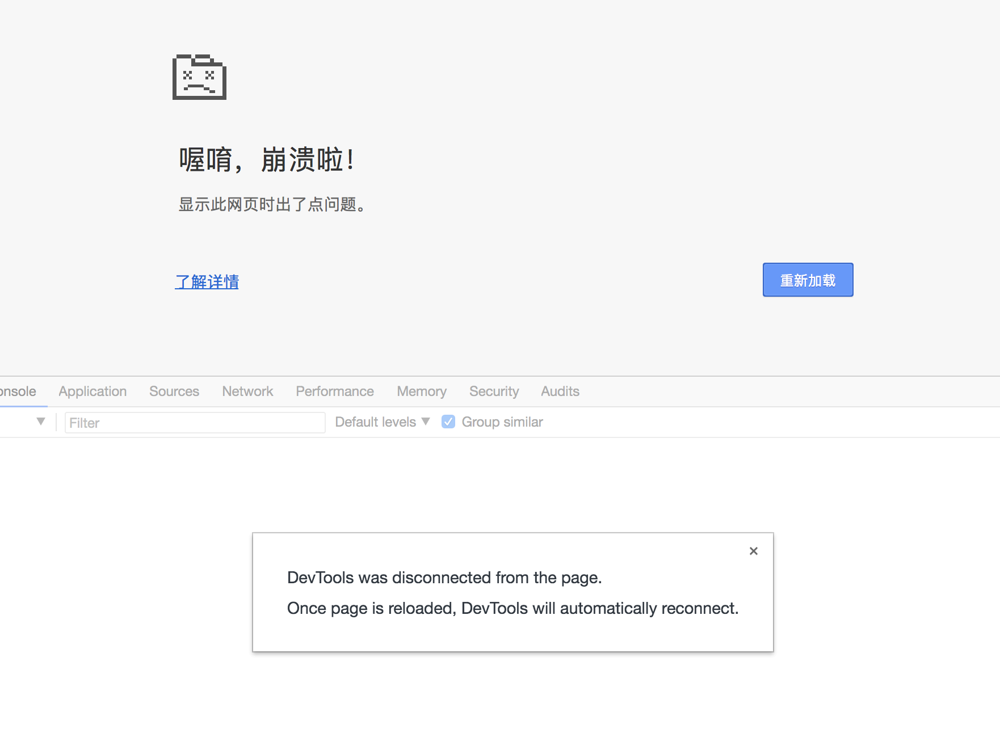
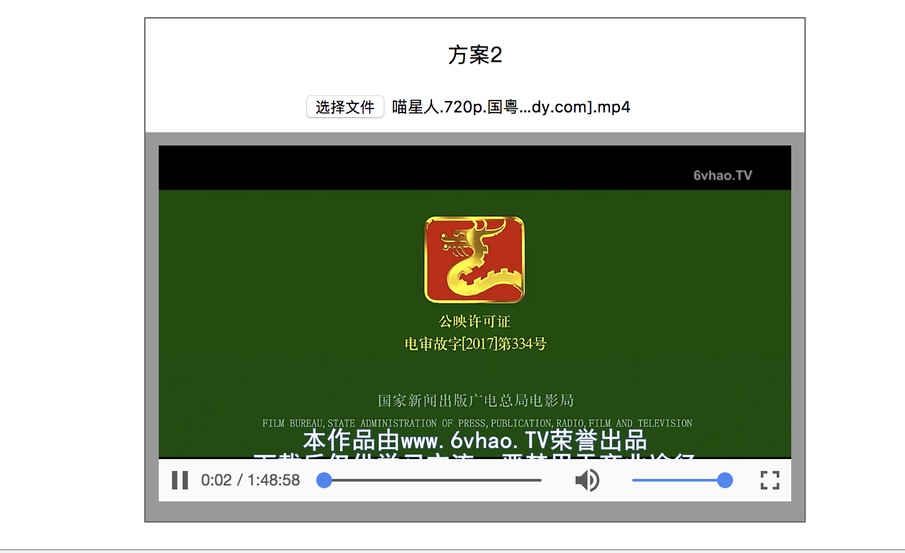

# FileReader与URL.createObjectURL实现图片、视频上传预览

[原文链接](https://xiaotianxia.github.io/blog/vuepress/js/upload_using_filereader_createobjecturl.html)

之前做图片、视频上传预览常用的方案是先把文件上传到服务器，等服务器返回文件的地址后，再把该地址字符串赋给img或video的src属性，这才实现所谓的文件预览。实际上这只是文件“上传后再预览”，这既浪费了用户的时间，也浪费了不可轻视的流量。

最近上网查资料才知道其实可以很轻松地实现“上传前预览”。实现方法有两种：FileReader和URL.createObjectURL。
关于FileReader的讲解可以看[这里](https://developer.mozilla.org/zh-CN/docs/Web/API/FileReader)

关于URL.createObjectURL方法的讲解和应用可以看[这里](https://developer.mozilla.org/en-US/docs/Using_files_from_web_applications#Example.3A_Using_object_URLs_to_display_images)

[demo地址](https://xiaotianxia.github.io/demos-2017/%E4%B8%8A%E4%BC%A0%E9%A2%84%E8%A7%88-%E4%B8%A4%E7%A7%8D%E6%96%B9%E6%A1%88/test.html)
#### 直接上代码：

```html
<!DOCTYPE html>
<html lang="en">
<head>
    <meta charset="UTF-8">
    <title>preview</title>
    <style>
        * {
            box-sizing: border-box;
        }
        .section {
            margin: 20px auto;
            width: 500px;
            border: 1px solid #666;
            text-align: center;
        }
        .preview {
            width: 100%;
            margin-top: 10px;
            padding: 10px;
            min-height: 100px;
            background-color: #999;
        }
        .preview img,
        .preview video {
            width: 100%;
        }
    </style>
    <script src="https://cdn.staticfile.org/jquery/3.2.1/jquery.min.js" type="text/javascript"></script>
</head>
<body>
    <div class="section">
        <p>方案1</p>
        <input class="upload" type="file" onchange=onUpload1(this.files[0])>
        <div class="preview preview1"></div>
    </div>

    <div class="section">
        <p>方案2</p>
        <input class="upload" type="file" onchange=onUpload2(this.files[0])>
        <div class="preview preview2"></div>
    </div>
    <script>
        function onUpload1 (file) {
            var fr = new FileReader();
            fr.readAsDataURL(file);  // 将文件读取为Data URL

            fr.onload = function(e) {
                var result = e.target.result;
                if (/image/g.test(file.type)) {
                    var img = $('');
                    $('.preview1').html('').append(img);
                } else if (/video/g.test(file.type)) {
                    var vidoe = $('<video controls src="' + result + '">');
                    $('.preview1').html('').append(vidoe);
                }
            }
        }

        function onUpload2 (file) {
            var blob = new Blob([file]), // 文件转化成二进制文件
                url = URL.createObjectURL(blob); //转化成url
            if (/image/g.test(file.type)) {
                var img = $('');
                img[0].onload = function(e) {
                    URL.revokeObjectURL(this.src);  // 释放createObjectURL创建的对象
                }
                $('.preview2').html('').append(img);
            } else if (/video/g.test(file.type)) {
                var video = $('<video controls src="' + url + '">');
                $('.preview2').html('').append(video);
                video[0].onload = function(e) {
                    URL.revokeObjectURL(this.src);  // 释放createObjectURL创建的对象
                }
            }
        }
    </script>
</body>
</html>
```
#### demo截图：

<hr>


<hr>




可以看出FileReader和URL.createObjectURL都能完美的实现图片的预览，但对于视频的上传，FileReader就不行了，浏览器立马崩溃了。。。，然而URL.createObjectURL方法却完美实现。

关于二者的具体区别在网上一时没查清楚，但总体感觉URL.createObjectURL比FileReader性能更好一些。有什么说错的地方还望指正。
