# 浅学 View Transitions API

[原文链接](https://xiaotianxia.github.io/blog/vuepress/js/view_transitions.html)

## 简介

在原生APP中，我们经常会看到那种丝滑又舒适的页面切换动画，比如这样的


Android 里一般称之为共享元素（shareElement）动画，也就是动画前后有一个（或多个）相同的元素，起到前后过渡的效果，可以很清楚的看到元素的变化过程，而并不是简单的消失和出现。
现在，web 中（chrome 111+）也迎来了这样一个特性，叫做视图转换动画  **View Transitions** ，又称“转场动画”，也能很轻松的实现这类效果。
今天我们就通过一些 demo 一起了解一下这个API。

### 是什么

先看两个较成熟的例子——


[demo地址](https://deploy-preview-28--http203-playlist.netlify.app/)


[demo地址](https://view-transition-astro-demo.netlify.app/)

::: warning
注意：在浏览器的地址栏中键入 chrome://flags，找到 viewTransition API for navigations 并将其更改为”已启用（Enabled）”。
:::


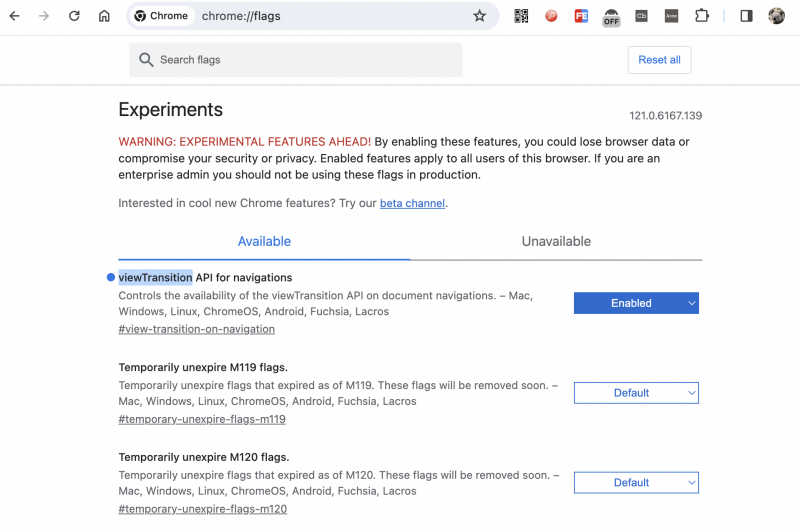

至此，web上动画的实现方式就有又多了一种——

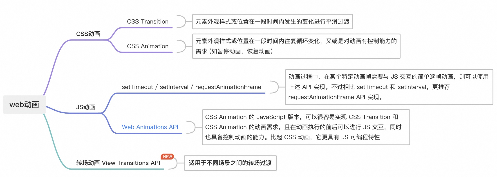

### 怎么用

唯一的API：

```js
document.startViewTransition(callback) // callback 页面元素转换的相关操作
```

该API返回一个transition实例，该实例有一个方法和三个只读属性，均为 promise 对象。

- skipTransition() 跳过场景动画过渡部分，但不会跳过回调函数 (即更新 DOM 树) 的执行

```js
transition.skipTransition(); // 跳过场景转场动画，仅更新 DOM 树
```

- ready

```js
transition.ready.then(() => {
  // Wait for the pseudo-elements to be created:
  doSomething();
});
```

- finished

```js
transition.finished.then(() => {
  // when transition animation is finished
  doSomething();
});
```

- updateCallbackDone

```js
transition.updateCallbackDone.then(() => {
  // Respond to the DOM being updated successfully
  doSomething();
});
```

🌰 举个最简单的例子（动态添加项目）

左侧是直接插入元素，有测试通过 View Transitions API 插入

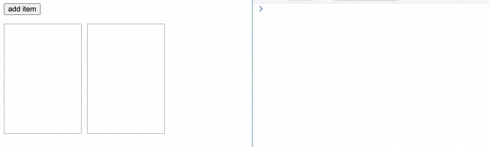

[代码地址](https://codepen.io/_tianxia/pen/yLwwRPp)

🌰 再举个例子 （暗模式背景切换简单应用）

只需要通过 View Transitions API 切换不同的类名，即可实现流畅的切换动画

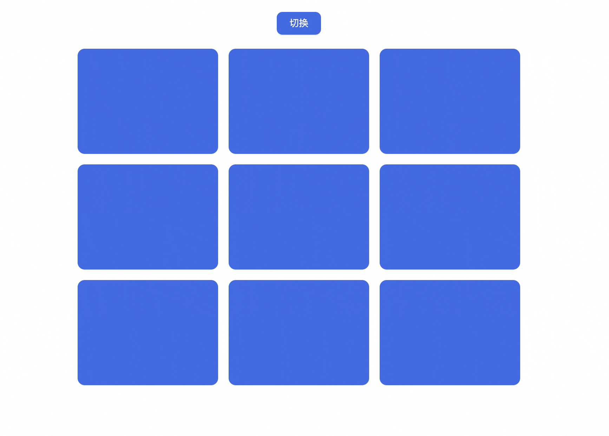

[代码地址](https://codepen.io/_tianxia/pen/MWxBrWz)

### 命名

在 View Transitions  动画执行的过程中，默认会在页面根节点下自动创建一组伪元素：

```dash
::view-transition  # 视图过渡根元素，包含所有视图过渡组，且位于其他页面内容的顶部
├─ ::view-transition-group(root)  # 默认视图过渡组 (root)
    └─ ::view-transition-image-pair(root)  # 承载一个过渡中旧视图状态和新视图状态的容器
        ├─ ::view-transition-old(root)  # 旧视图状态
        └─ ::view-transition-new(root)  # 新视图状态
```

通过调用 API，让浏览器为新旧两种不同视图分别捕获并建立了快照 (即 ::view-transition-old 旧快照 和 ::view-transition-new 新快照)，而后新旧两快照在 ::view-transition-image-pair 容器中完成转场动画的过渡。动画结束后则删除其相关伪元素 (快照和容器)。
动画执行的基本过程如下图所示：

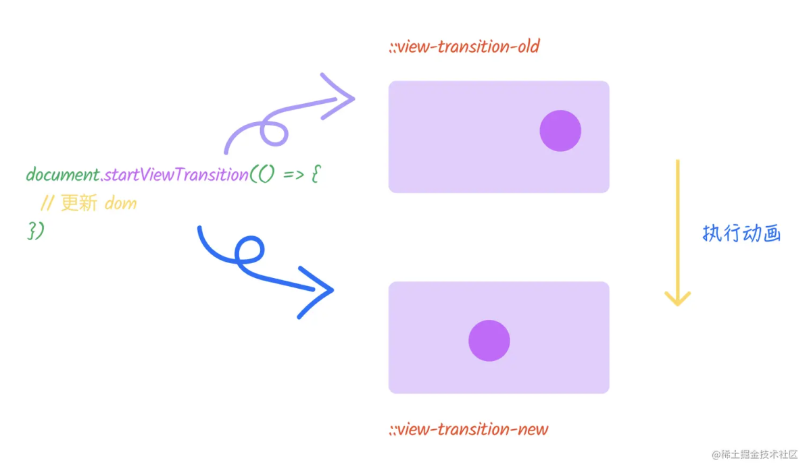

::: warning TL;DR

- 开发者通过 document.startViewTransition(callback) 启动转场动画，其中 callback 函数是用来更新 DOM 状态 (即更新为新视图状态)
- 捕获当前状态为旧视图状态
- 暂停 DOM 树渲染
- 回调函数 callback 被调，用来更新文档状态 (可以是异步函数，返回 Promise)
- 回调函数 callback 成功后，transition.updateCallbackDone 被满足 (即 promise is resolved)
- 恢复 DOM 树渲染，而后捕获当前状态为新视图状态
- 创建过渡伪元素 (即 ::view-transition-old、::view-transition-new ...等)
- 渲染未暂停，显示过渡伪元素
- transition.ready 被满足 (即 promise is resolved)
- 伪元素开始动画，直至动画完成
- 删除了过渡伪元素
- transition.finished 被满足 (即 promise is resolved)
:::

若需要使某个元素执行过渡动画，需要给每个元素添加一个自定义属性：view-transition-name，且每个元素的 view-transition-name 必须唯一，即同一个页面上渲染的元素(display非none) view-transition-name 不同重复。

🌰 举个例子（点击删除元素）

为了使每个元素被删除时消失的自然流畅，我们需要为每个元素添加不同的 view-transition-name。

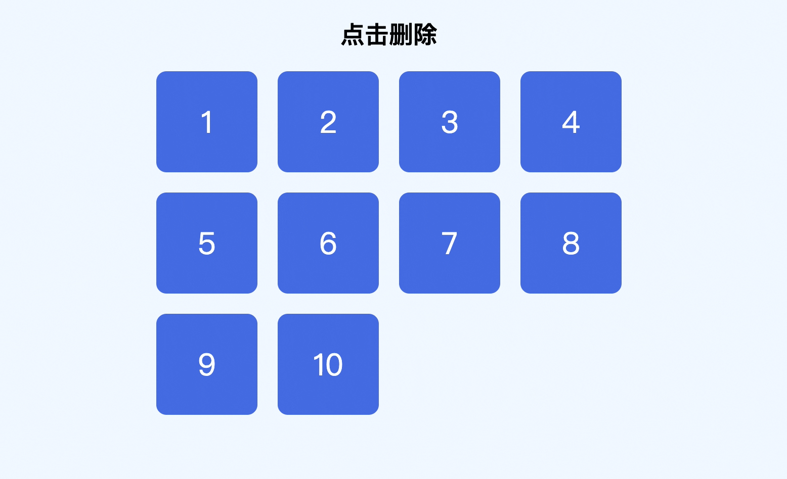

[代码地址](https://codepen.io/_tianxia/pen/eYXjeeK)

否则效果是这样的（整体上淡入淡出，因为这时转场的元素是root）：

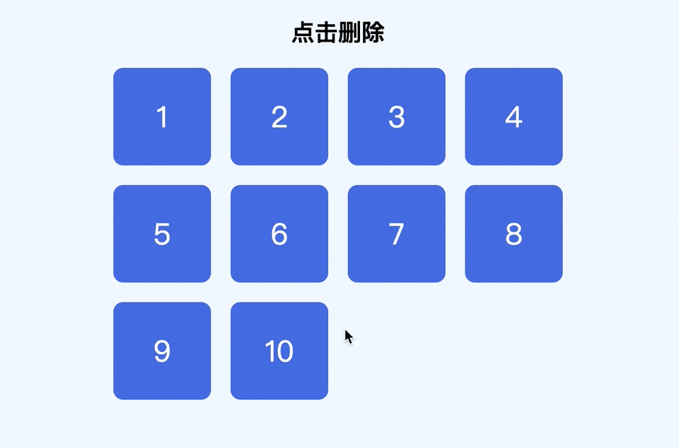

[代码地址](https://codepen.io/_tianxia/pen/BabEGex)

这时候，每个被命名的元素都会生成一系列对应的伪元素：
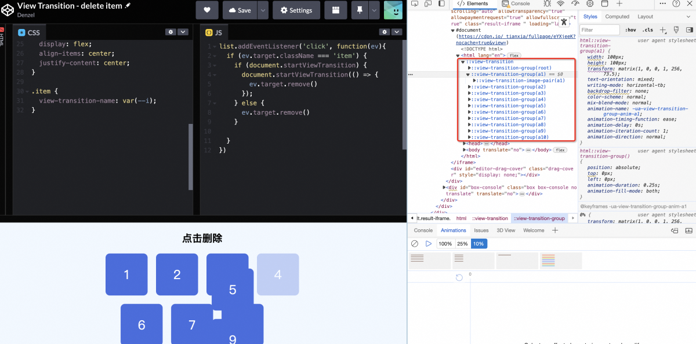

::: warning
视图变化其实和元素是否相同没有关联，有关联的只有 view-transition-name，浏览器是根据 view-transition-name 寻找的，也就是相同名称的元素在前后会有一个过渡动画。CSS动画或过渡只限制在同一个DOM元素，而 View Transitions API 即使是不同的 Dom 元素，也可以通过 view-transition-name 属性关联动画，实现转场过渡。
:::

🌰 举个例子 ：

我们给两个不同的元素设置同一个 view-transition-name: spot，但是通过切换其 display 的 bolck 或 none 保证同一页面只有一个元素的 view-transition-name 是 spot。

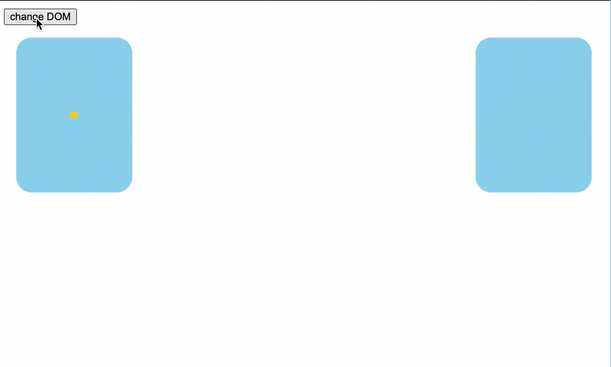

[代码地址](https://codepen.io/_tianxia/pen/yLwwEzp)

🌰 再看个例子：

实现思路与上面的例子基本一样

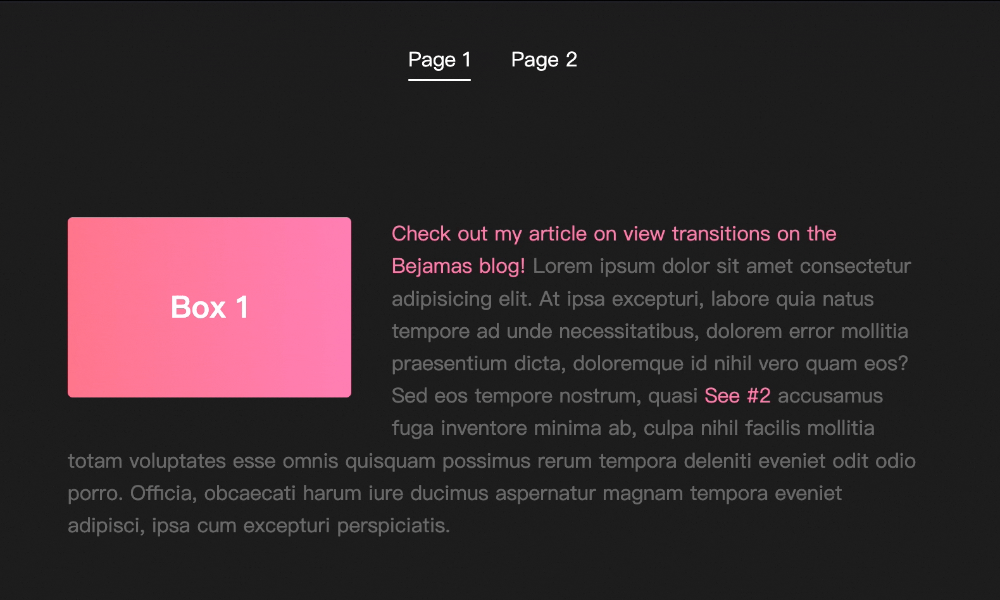

[代码地址](https://codepen.io/_tianxia/pen/mdooKEd)


#### 动画调试
调出动画调试工具（打开开发者工具 → ctrl/command + shift + p → 输入 animations；或者，右上角三个点 → more tools → Animations）,通过 Animations 工具调试动画的过程如下所示。可以调慢动画的速度或暂停动画，查看动画的整个过程以及过程中产生的各种伪元素。

[demo1](https://codepen.io/_tianxia/full/mdooKEd)：


[demo2](https://deploy-preview-28--http203-playlist.netlify.app/videos/deno/)：

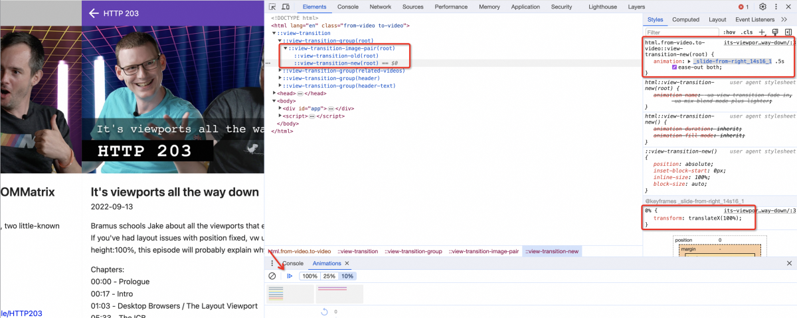

#### 其他 demo

再体验下其他 demo ——

- 卡片 [https://code.juejin.cn/pen/7292693744531275803](https://code.juejin.cn/pen/7292693744531275803)
- 拖拽排序 [https://codepen.io/argyleink/pen/rNQZbLr](https://codepen.io/argyleink/pen/rNQZbLr)
- 数字过渡动画 [https://codepen.io/argyleink/pen/jOQKdeW](https://codepen.io/argyleink/pen/jOQKdeW)

#### MPA(Cross-document View Transitions)

以上 demo 都是在同一页面(SPA)的转场交互，在不同页面跳转时，也可以添加转场动画——
简直不能再简单了，只需要加一行meta标签！！

```html
<meta name="view-transition" content="same-origin">
```

看下效果：
- before：


[demo地址](https://view-transition-demo-basic.netlify.app/) [参考代码](https://github.com/seyedi/view-transition-demo/tree/basic)

- after：


[demo地址](https://view-transition-demo-crossfade.netlify.app/) [参考代码](https://github.com/seyedi/view-transition-demo/tree/crossfade)
	

也可以添加自定义转场动画 ——

```css
@keyframes fade-in {
  from {
    opacity: 0;
  }
}

@keyframes fade-out {
  to {
    opacity: 0;
  }
}

@keyframes slide-from-bottom {
  from {
    transform: translateY(50px);
  }
}

@keyframes slide-to-top {
  to {
    transform: translateY(-50px);
  }
}

::view-transition-old(root) {
  animation:
    90ms cubic-bezier(0.4, 0, 1, 1) both fade-out,
    300ms cubic-bezier(0.4, 0, 0.2, 1) both slide-to-top;
}

::view-transition-new(root) {
  animation:
    210ms cubic-bezier(0, 0, 0.2, 1) 90ms both fade-in,
    300ms cubic-bezier(0.4, 0, 0.2, 1) both slide-from-bottom;
}
```

看下效果 ——
	
- 动画1：


[demo地址](https://view-transition-demo-slideup.netlify.app/) [参考代码](https://github.com/seyedi/view-transition-demo/blob/slideup/view-transition.css)

- 动画2：


[demo地址](https://bejamas-view-transition-demo.netlify.app/) [参考代码](https://github.com/seyedi/view-transition-demo/blob/main/view-transition.css)


### 一个支持View Transitions API的框架 - astro

[官网地址](https://astro.build/) [使用文档](https://docs.astro.build/en/guides/view-transitions/)

#### 对于MPA

```html
import { ViewTransitions } from 'astro:transitions';

<html lang="en">
  <head>
    <title>My Homepage</title>
    <ViewTransitions />
  </head>
  <body>
    <h1>Welcome to my website!</h1>
  </body>
</html>
```

#### 对于SPA

- 使用内置动画

```html
import { fade } from 'astro:transitions';

<header transition:animate={fade({ duration: '0.4s' })} />
```

- 使用自定义动画

```html
const anim = {
  old: {
    name: 'fadeIn',
    duration: '0.2s',
    easing: 'linear',
    fillMode: 'forwards',
  },
  new: {
    name: 'fadeOut',
    duration: '0.3s',
    easing: 'linear',
    fillMode: 'backwards',
  }
};

const myFade = {
  forwards: anim,
  backwards: anim,
};

<header transition:animate={myFade} />
```

### 总结

从体验上看，在动画过程中页面DOM渲染是挂起的，此时页面的任何交互都是不响应的，因此转场动画的时间不宜设置太长。
目前该 API 的支持还不尽如人意，同样，让我们寄希望于未来吧。💪🏻

### 参考文章

- [An Introduction to the View Transitions API](https://www.sitepoint.com/view-transitions-api-introduction/)
- [View Transitions API & meta frameworks: a practical guide](https://bejamas.io/blog/what-is-view-transitions-api/)
- [Smooth and simple transitions with the View Transitions API](https://developer.chrome.com/docs/web-platform/view-transitions?hl=en)
- [讲解 Web 转场动画 View Transitions API](https://juejin.cn/post/7293118779780825138)