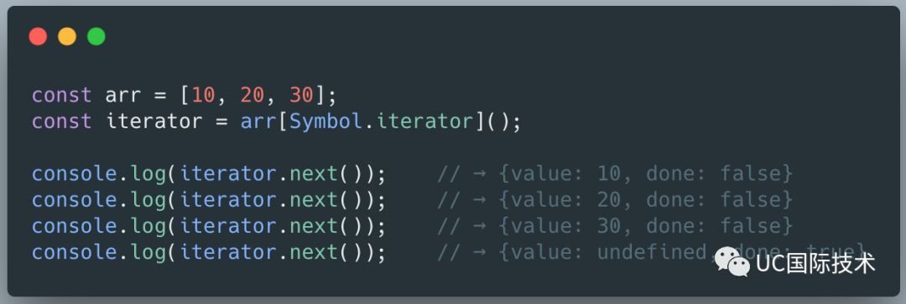
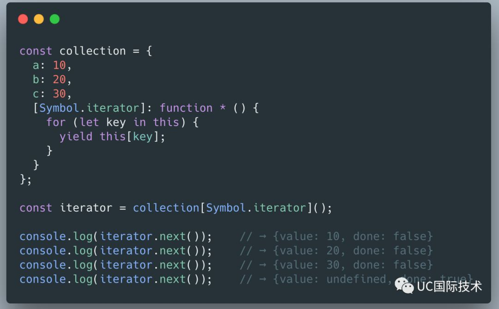

# es6

## 新特性总览
- 1. let const (变量声明)
- 2. 解构赋值 
- 3. Promise 对象 
- 4. async / await (nodejs controller中经常使用，查询数据库)
- 5. 箭头函数
- 6. 模板字符串
- 7. 字符扩展方法: 
    - 1. 查找 String.prototype.includes() startWith endsWith 
- 8. 函数引入了: rest参数 fn(...param) & 箭头函数
- 9. ... 扩展运算符
- 10. 数组扩展方法: 
    - 1. 查找：find() findIndex() includes()  
    - 2. 遍历：keys() entries() values() 
- 11. 对象扩展方法: 
    - 1. Object.assign() 
    - 2. Object.keys() Object.entries() Object.setPrototypeOf() Object.values() 
    - 3. Object.getOwnPropertyDescriptors()
    - 4. __proto__属性，Object.()，Object.getPrototypeOf() 设置对象的原型，非常重要
- 12. 循环：for...of
- 13. Class 
- 14. Module 
    - 1. import 
    - 2. export
- 15. Number isFinite isNaN isInteger
- 16. Set Map 两种新的数据类型(数据结构) 
    - 1. Set (去重的数组)
        - 1. size
        - 2. has add delete clear() 
        - 3. 遍历: keys values entries 返回的都是一个遍历器对象
    - 2. Map (键值类型没有限制的map)
        - 1. set get
        - 2. has delete clear()    
        - 3. 遍历: keys values entries 返回的都是一个遍历器对象
- 17. Iterator 和 for...of 循环 (引入了遍历器对象的概念,与之搭配的是新的for of 遍历方法)

## let const
- let 用来声明变量，并且会在当前作用域形成代码块 TDZ(Temporal Dead Zone)暂时性死区
- const 用来声明常量，所谓常量就是**物理指针**不可以更改的变量。即任何改变内存地址的操作都不允许。除此之外特性跟 let 一样。对于引用类型的数据，在使用时要注意。
- const 声明的对象或数组可以改变，只要不改变其内存地址。不能做到冻结对象，要冻结对象还要使用Object.freeze();
```js
var constantize = (obj) => {
  	Object.freeze(obj);
  	Object.keys(obj).forEach(key => {
    	if (typeof obj[key] === 'object') {
      		constantize(obj[key]);
    	}
  	});
};
```
- let声明变量，变量不会提升

## 箭头函数
除了便捷的写法外，注意this的指向问题：
- 默认绑定外层this
```js
const obj = {
	a: function() {
		console.log(this);
	}    
}
obj.a()  //打出的是obj对象
```

```js
const obj = {
    a: () => {
        console.log(this);
    }
}
obj.a()  //打出来的是window
```
- 不能用call方法修改里面的this
```js
const obj = {
    a: () => {
        console.log(this);
    }
}
obj.a.call('123')  //打出来的结果依然是window对象
```
- 箭头函数不会创建自己的this,它只会从自己的作用域链的上一层继承this。
箭头函数不使用自身的this，而是一层一层的向上查找，直到有this，即箭头函数的this指向的是外层不是箭头函数的this。
```js
const obj = {
    a: function() { console.log(this) },
    b: {
    	c: function() {console.log(this)}
	}
}
obj.a()  // 打出的是obj对象, 相当于obj.a.call(obj)
obj.b.c() //打出的是obj.b对象, 相当于obj.b.c.call(obj.b)
```
```js
const obj = {
    a: function() { console.log(this) },
    b: {
    	c: () => {console.log(this)}
	}
}
obj.a()   //没有使用箭头函数打出的是obj
obj.b.c()  //打出的是window对象！！
```

## for in、for of、forEach
- forEach 用来遍历数组，遍历的是索引，但是不能中断循环(break或return）
- for in 可遍历数组和对象，遍历的是索引，但会把原型方法和可枚举属性全部遍历出来（可用hasOwnPropery筛选掉），且不能保证对象的内部顺序，不推荐用来遍历数组。
- for of 用来遍历iterable类型的对象，遍历的是元素值，Array、Map和Set都属于iterable类型。(普通对象{a: '1', b: '2', c: '3', d: '4'}不是iterable，不可以遍历)

## class
基本框架：
```js
	//变量方法名 可计算成员名称
	let funStr = 'get' + 'Age';
	class A {
		//静态属性
	    static sex = 'male';

	    constructor (name, job) {
	        this.name = name;
	        this.job = job || 'unkown';
	    }
	    
	    sayName () {
	        return this.name;
	    }
		
		//静态方法
	    static sayHeight () {
	        return '188cm';
	    }
	    
	    //getter
	    get myJob () {
	        return this.job;
	    }
	    
	    //setter
	    set myJob (job) {
	        this.job = job;
	    }
		
		//可计算成员名称
	    [funStr] () {
	        return 18;
	    }
	}


	console.log(A.sex);  // 'male'
	console.log(A.sayHeight()); // '188cm'

	let a = new A('Tom'); 
	console.log(a.sayName()); // 'Tom'
	console.log(a.myJob); // 'unkown'
	a.myJob = 'teacher';
	console.log(a.myJob); // 'teacher'
	console.log(a.getAge()); // '18'

```
继承：
```js
	class B extends A {
	    static sex = 'female';
	    constructor (name, job, married) {
	        super(name, job);
            this.married = married;
	    }
	    
	    sayName () {
            //super.sayName();
	        return 'Hi, I\'m ' + this.name;
	    }
	}

	console.log(B.sex);  // 'female'
	console.log(B.sayHeight()); // '188cm'

	let b = new B('Lucy', 'nurse', true);

	console.log(b.sayName()); // 'Hi, I'm Lucy'
	console.log(b.myJob); // 'nurse'
	b.myJob = 'teacher';
	console.log(b.myJob); // 'teacher'
	console.log(b.getAge()); // '18'

```
参考
[1](https://mp.weixin.qq.com/s?__biz=MzI4MDYyNjQ1OA==&mid=2247483956&idx=1&sn=adc1ec7ae4cd3f01728fdcb43a38690f&chksm=ebb4d641dcc35f57cd2bf66ba9819874cf300108884700bf3d6a1410c18c0ed4ff3d90d10a8f#rd)
[2](https://juejin.im/post/5b3f23066fb9a04fe820cdbe)

## Object的静态方法
- **Object.is()** - 比较两个对象是否相同，值类型对象比较值是否相等，引用类型对象比较内存地址是否相同。
- **Object.keys()** - 返回对象的可枚举属性数组。
- **Object.assign()** - 将多个对象的可枚举属性拷贝到目标对象上，并且返回赋值后的目标对象
- **Object.create()** - 获取一个类的原型（prototype）对象，返回值为参数类的原型对象。可用于类继承。
- **Object.defineProperties()** - 给对象定义属性，如果存在该属性，则用新定义的属性更新已存在的属性，如果不存在该属性，则添加该属性。
- **Object.defineProperty()** - 在对象上定义新属性，或修改对象现有属性，并返回该对象。
- **Object.entries()** - 遍历获取对象上所有可枚举的属性，返回结果是一个二维数组[['key1', 'value1'], ['key2', 'value2'], ...]
- **Object.freeze()** - 将一个对象上的属性冻结，阻止添加、删除、更新属性到该对象及其原型。返回被冻结的对象。
- **Object.getOwnPropertyDescriptors()** - 获取一个对象所有的直接属性的描述信息（直接在对象上的属性，而不是原型链上的属性）。
- **Object.getOwnPropertyDescriptor()** - 获取一个对象指定名称的直接属性的描述信息（直接在对象上的属性，而不是原型链上的属性），存在则返回该属性的描述信息，不存在则返回undefined。
- **Object.getOwnPropertyNames()** - 获取一个对象所有的直接属性的属性名称（直接在对象上的属性，而不是原型链上的属性）。返回属性名称字符串数组。
- **Object.getOwnPropertySymbols()** - 获取对象上所有的Symbol类型的属性列表。
- **Object.getPrototypeOf()** - 获取一个对象上的原型对象，其功能和 obj.\_proto_等同。

参考
[1](https://blog.csdn.net/qbian/article/details/79360972)


## promise 异常捕获
一般情况下，当Promise调用链中抛出一个异常时，异常信息会沿着链路向后传递，直至被捕获。

**Q1**: 在promise调用链中如何在某个then中捕获到异常，但是不停止后面then的执行？

若链路中也对异常进行了捕获，则后续的函数可能会继续执行，——
```js
//then添加第二个参数捕获异常，不影响后面then的执行
Promise.resolve()
    .then(() => {
        console.log('[onFulfilled_1]');
        throw 'throw on onFulfilled_1';
    })
    .then(() => {
        console.log('[onFulfilled_2]');
    }, err => {     // 捕获异常
        console.log('[onRejected_2]', err);
    })
    .then(() => {   // 该函数将被调用
        console.log('[onFulfilled_3]');
    })
    .catch(err => {
        console.log('[catch]', err);
    });
//[onFulfilled_1]
//[onRejected_2] throw on onFulfilled_1
//[onFulfilled_3]
```
**Q2**: 在promise调用链中如何在某个then中捕获到异常，立即停止后面then的执行？

Promise.prototype.then(onFulfilled, onRejected) 若onFulfilled或onRejected是一个函数，当函数返回一个新Promise对象时，原Promise对象的状态将跟新对象保持一致，详见Promises/A+标准。 

因此，当新对象保持“pending”状态时，原Promise链将会中止执行。
```js
Promise.resolve()
    .then(() => {
        console.log('[onFulfilled_1]');
        return new Promise(() => {}); // 返回“pending”状态的Promise对象
    })
    .then(() => {                   // 后续的函数不会被调用
        console.log('[onFulfilled_2]');
    })
    .catch(err => {
        console.log('[catch]', err);
    });
//[onFulfilled_1]
```

**Q3**: 为了防止有漏掉的 Promise 异常，建议在全局增加一个对 unhandledrejection 的监听，用来全局监听Uncaught Promise Error。使用方式：
```js
window.addEventListener('unhandledrejection', function(e) {
    console.log(e);
});
```
然而自己在浏览器上常识并不好使。。。。

## Symbol
### 可用来实现私有变量
```js
// 定义symbol
const _x = Symbol('x')

class A {
    constructor (x) {
        // 利用symbol声明私有变量
        this[_x] = x
    }
    showX () {
        return this[_x]
    }
}

let a = new A(1);

// 自行定义一个相同的Symbol
const x = Symbol('x')
// 无法访问
a[x]        // undefined
// 可以访问
a.showX()   //1
```
参考
[1](https://juejin.im/post/5c25faf3f265da61380f4b17)

### Symbol.iterator
如果对象具有 Symbol.iterator 属性，则表示它是可迭代的。在 ES2015 中，字符串和集合对象（如Set, Map 和 Array）带有Symbol.iterator 属性，因此是可迭代的。

如


普通对象不可迭代，但如果在其上定义了 Symbol.iterator 属性，则它可变为可迭代对象

如


以上过程可以使用生成器（ generator ）函数进行大大简化：


### Symbol、Symbol.for、Symbol.keyFor
```js
Symbol('red') === Symbol('red');   //false
Symbol.for('red') === Symbol.for('red');   //true
```
```js
var s1 = Symbol.for("foo");
Symbol.keyFor(s1) // "foo"

var s2 = Symbol("foo");
Symbol.keyFor(s2) // undefined
```
### Symbol应用
- 使用Symbol来作为对象属性名(key)
- 使用Symbol来替代常量
- 使用Symbol定义类的私有属性/方法

[参考](https://www.jianshu.com/p/f40a77bbd74e)

## Proxy/Reflect
Proxy 拦截对象行为
```js
var obj = new Proxy({}, {
    get: function (target, key, receiver) {
        console.log(`getting ${key}!`);
        return Reflect.get(target, key, receiver);
    },
    set: function (target, key, value, receiver) {
        console.log(`setting ${key}!`);
        return Reflect.set(target, key, value, receiver);
    }
});
```

### Reflect
- 为操作对象而提供的新API
- 不是构造函数，只这么调用 Reflect['method']
- Proxy 有的方法，Reflect都有
- 举例：
    - 'a' in obj --> Reflect.has(obj, 'a);
    - delete obj.a --> Reflect.deleteProperty(obj, 'a');
    - Object.defineProperty(target, property, attributes) 失败会报错 --> Reflect.defineProperty(target, property, attributes) 返回true/false
    - 等等

参考
[1](https://juejin.im/post/5b62e19cf265da0fa1224248)

## async/await
特点：
- async 函数是 Generators和Promises特性功能的语法糖
- 建立在 promise 之上。它会声明一个异步函数，并隐式地返回一个Promise。因此可以直接return变量，无需使用 Promise.resolve 进行转换。
- 和 promise 一样，是非阻塞的。但不用写 then 及其回调函数，这减少代码行数，也避免了代码嵌套。而且，所有异步调用，可以写在同一个代码块中，无需定义多余的中间变量。
- 它的最大价值在于，可以使异步代码在形式上更接近于同步代码。
- 与 await 一起使用，await 只能在 async 函数体内。
- await 是个运算符，用于组成表达式，它会阻塞后面的代码。如果等到的是 Promise 对象，则得到其 resolve 值。否则，会得到一个表达式的运算结果。

举例：某业务，每一个步骤都需要之前每个步骤的结果。promise 写法：
```js
function doIt() {
    console.time("doIt");
    const time1 = 300;
    step1(time1)
        .then(time2 => {
            return step2(time1, time2)
                .then(time3 => [time1, time2, time3]);
        })
        .then(times => {
            const [time1, time2, time3] = times;
            return step3(time1, time2, time3);
        })
        .then(result => {
            console.log(`result is ${result}`);
        });
}
doIt();
```
async/await 写法：
```js
async function doIt() {
    console.time("doIt");
    const time1 = 300;
    const time2 = await step1(time1);
    const time3 = await step2(time1, time2);
    const result = await step3(time1, time2, time3);
    console.log(`result is ${result}`);
}
doIt();
```
await 在等什么 
- 如果它等到的不是一个 Promise 对象，那 await 表达式的运算结果就是它等到的东西。
- 如果它等到的是一个 Promise 对象，它会阻塞后面的代码，等着 Promise 对象 resolve，然后得到 resolve 的值，作为 await 表达式的运算结果。

[1](https://segmentfault.com/a/1190000007535316)
[2](https://juejin.im/post/5c39523651882525a67c53d6)
[3](https://juejin.im/post/5c45dffef265da61163a13e2)

## Set、WeakSet 和 Map、 WeakMap
- Set
    - 成员唯一、无序且不重复
    - [value,  value]，键值与键名是一致的（或者说只有键值，没有键名）
    - 操作方法有：add() 、 delete() 、 has() 、 clear()
    - 可以遍历，方法有：keys() 、 values() 、 entries() 、 forEach()

- WeakSet
    - 成员都是对象
    - 成员都是弱引用，可以被垃圾回收机制回收，可以用来保存DOM节点，不容易造成内存泄漏
    - 操作方法有：add() 、 delete() 、 has()
    - 不能遍历

- Map
    - 本质上是键值对的集合，类似集合
    - 可以遍历，方法很多可以跟各种数据格式转换

- WeakMap
    - 只接受对象最为键名（null除外），不接受其他类型的值作为键名
    - 键名是弱引用，键值可以是任意的，键名所指向的对象可以被垃圾回收，此时键名是无效的
    - 操作方法有： get() 、 set() 、 delete() 、 has()
    - 不能遍历

[1](https://github.com/Advanced-Frontend/Daily-Interview-Question/issues/6)

对弱引用的理解
- WeakSet 类似于 Set ，仅存储对象。WeakMap 类似于 Map，键必须是对象。
- WeakMap/WeakSet 中对对象是弱引用，垃圾回收机制不会考虑 WeakMap 对该对象的引用，也就是 JavaScript不会阻止将对象从内存移除。
- WeakSet / WeakMap 没有部署 Iterator 接口，所以不能用for...of遍历。因为垃圾回收机制随时会对他们的值进行回收，所以个数并不确定。
```js
let obj = {id: 1}
const wm = new WeakMap([[obj, 'sina']])
obj = null  // 重写obj {id: 1}将会从内存移除，不考虑 wm 还在引用它
```
- 使用
    - 记录访问次数
    ```js
    let jack = { name: "jack" };
    const vistedCount = new WeakMap();
    vistedCount.set(jack, 123);
    // 当 jack 离开，就不需要保存其访问记录
    jack = null;
    // 除了 vistedCount 没有其他引用了
    // 所以这个对象会自动的从内存和 vistedCount 中删除，不会造成内存泄漏
    ```
    - 注册监听事件
    ```js
    const listener = new WeakMap();
    listener
        .set(ele1, func1);
        .set(ele2, func2);
    ele1.addEventListener('click', listener.get(ele1), false);
    ele2.addEventListener('click', listener.get(ele2), false);
    // 监听函数放在 WeakMap 中，一旦DOM移除，监听函数也随之从内存移除，不会造成内存泄漏。
    ```
[2](https://www.jianshu.com/p/c99dd69a8f2c)


## let 、cosnt 与 var 的区别
let:
- 不存在变量提升
- 暂时性死区
- 不允许重复声明
const
- 与 let 类似，声明的变量指向同一地址，不允许改变，因此基本类型不能改变值，引用类型可以改变内部属性，但不能改变指向。

## 箭头函数与普通函数区别
- 箭头函数体内的this对象，就是定义时所在的对象，而不是使用时所在的对象，箭头函数没有自己的this。
- 不可以当作构造函数，也就是说，不可以使用new命令，没有super、new.target。没有自己的this，因此不可以用作构造函数，不能用 call()，apply()，bind()这些方法去改变 this 的指向
- 不可以使用arguments对象，该对象在函数体内不存在。如果要用，可以用 rest 参数代替。
- 不可以使用yield命令，因此箭头函数不能用作 Generator 函数。
- 没有 prototype 属性


