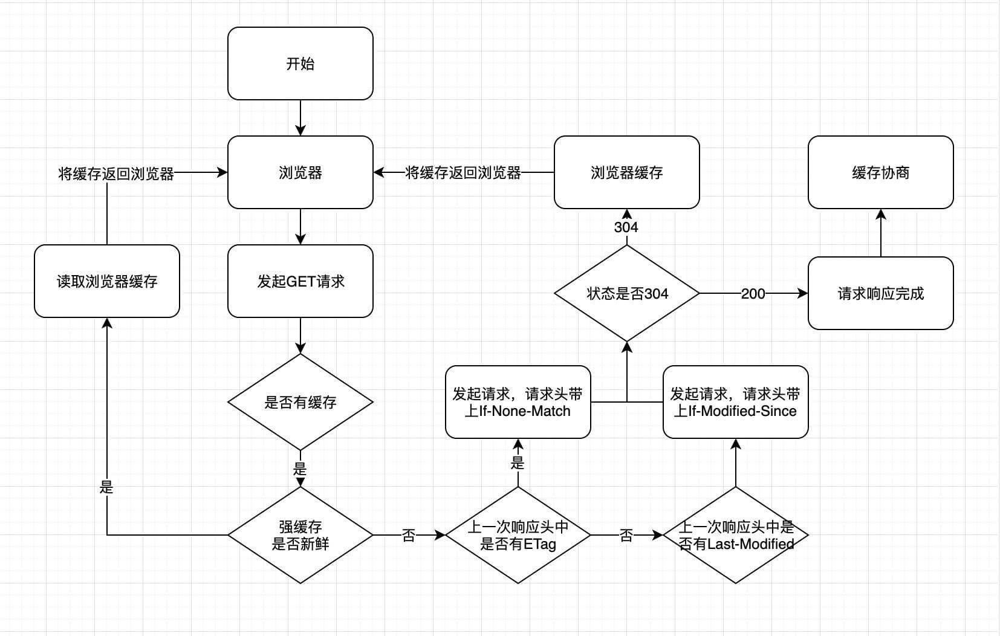
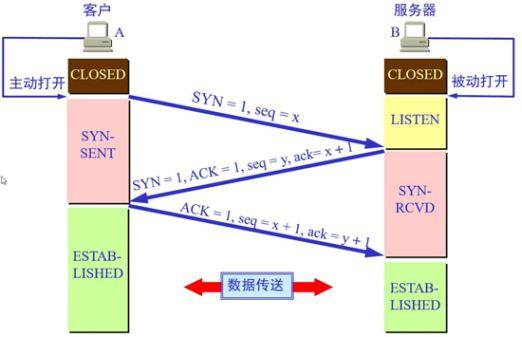
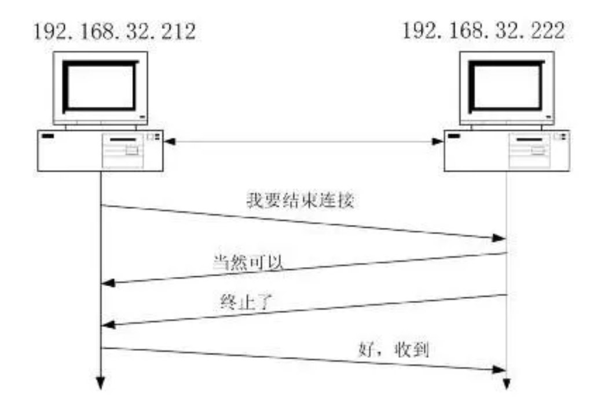

# http

## get 、post ?

- GET在浏览器回退时是无害的，而POST会再次提交请求。
- GET产生的URL地址可以被Bookmark，而POST不可以。
- GET请求会被浏览器主动cache，而POST不会，除非手动设置。
- GET请求只能进行url编码，而POST支持多种编码方式。
- GET请求参数会被完整保留在浏览器历史记录里，而POST中的参数不会被保留。
- GET请求在URL中传送的参数是有长度限制的，而POST没有。
- 对参数的数据类型，GET只接受ASCII字符，而POST没有限制。
- GET比POST更不安全，因为参数直接暴露在URL上，所以不能用来传递敏感信息。
- GET参数通过URL传递，POST放在Request body中。

实际上————

GET和POST本质上就是TCP连接，并无差别。但是由于HTTP的规定和浏览器/服务器的限制，导致他们在应用过程中体现出一些不同。

两者有一个最大的区别就是——

**GET产生一个TCP数据包；POST产生两个TCP数据包。**

对于GET方式的请求，浏览器会把http header和data一并发送出去，服务器响应200（返回数据）；
而对于POST，浏览器先发送header，服务器响应100 continue，浏览器再发送data，服务器响应200 ok（返回数据）。

参考
[1](https://mp.weixin.qq.com/s?__biz=MzI3NzIzMzg3Mw==&amp;mid=100000054&amp;idx=1&amp;sn=71f6c214f3833d9ca20b9f7dcd9d33e4#rd)

## 缓存
缓存位置：
- 它们的优先级是：(由上到下寻找，找到即返回；找不到则继续)
    - Service Worker
    - Memory Cache
    - Disk Cache
    - 网络请求

- 当浏览器要请求资源时
    - 调用 Service Worker 的 fetch 事件响应
    - 查看 memory cache
    - 查看 disk cache。这里又细分：
        - 如果有强制缓存且未失效，则使用强制缓存，不请求服务器。这时的状态码全部是 200
        - 如果有强制缓存但已失效，使用对比缓存，比较后确定 304 还是 200

- 发送网络请求，等待网络响应
- 把响应内容存入 disk cache (如果 HTTP 头信息配置可以存的话)
- 把响应内容的引用存入 memory cache (无视 HTTP 头信息的配置)
- 把响应内容存入 Service Worker 的 Cache Storage (如果 Service Worker 的脚本调用了 cache.put())
[1](https://juejin.im/post/5c22ee806fb9a049fb43b2c5#heading-2)

缓存策略：
- 强缓存
- 协商缓存

[1](https://juejin.im/post/5c417993f265da61285a6075#heading-0)
[2](https://github.com/lgwebdream/FE-Interview/issues/14)

## DNS解析过程
Domain Name Server，域名服务器，是进行域名(domain name)和与之相对应的IP地址 (IP address)转换的服务器。

- 1.判断本地的HOSTS文件是否存在相应映射文件。存在就返回
- 2.不存在的话，查询本地DNS解析缓存。
- 3.查询TCP/IP中设置的首个DNS服务器，查询本地区域是否存在相应映射。
- 4.如果查询的域名不由本地区域管理，查看本地DNS缓存中是否存在映射。
- 5.跳转至根DNS服务器，查询负责该请求的顶级域，并返回一个负责该域的IP地址。
- 6.本地DNS在根据该顶级域去联系负责该IP地址的域。
- 7.如果采用转发模式，会将返回结果交由上一级DNS服务器处理，如果不能处理，交由根DNS服务器处理或者上上级处理。

## cookie 的几个属性
domain 、 path 、 expired、 max-age 、 secure 、httpOnly 、sameSite
[参考](https://juejin.im/post/5e718ecc6fb9a07cda098c2d#heading-2)

## TCP三次握手/四次挥手


[参考](https://baijiahao.baidu.com/s?id=1654225744653405133&wfr=spider&for=pc)

## CSP (Content Security Policy)
“网页安全政策”。
CSP 的实质就是白名单制度，开发者明确告诉客户端，哪些外部资源可以加载和执行，等同于提供白名单。它的实现和执行全部由浏览器完成，开发者只需提供配置。
- 两种方法可以启用 CSP
    - 通过 HTTP 头信息的Content-Security-Policy的字段。
    - 通过网页的meta标签。
```
Content-Security-Policy: script-src 'self'; object-src 'none';
style-src cdn.example.org third-party.org; child-src https:
```
或  
```
<meta http-equiv="Content-Security-Policy" content="script-src 'self'; object-src 'none'; style-src cdn.example.org third-party.org; child-src https:">
```
以上的配置意为：
- 脚本：只信任当前域名
- object 标签：不信任任何URL，即不加载任何资源
- 样式表：只信任 cdn.example.org 和 third-party.org
- 框架（frame）：必须使用HTTPS协议加载
- 其他资源：没有限制

[参考](http://www.ruanyifeng.com/blog/2016/09/csp.html)

## 跨域
- 跨域并不是请求发不出去，请求能发出去，服务端能收到请求并正常返回结果，只是结果被浏览器拦截了。

解决跨域常用方案：
- jsonp (JSON with Padding) 只支持GET请求
- CORS (Cross-origin resource sharing) 跨域HTTP请求的根本解决方案
- postMessage
- websocket
- Node中间件代理
- nginx反向代理
- window.name + iframe
- location.hash + iframe
- document.domain + iframe 只能用于二级域名相同的情况

参考
[1](https://juejin.im/post/5c23993de51d457b8c1f4ee1)
[2](https://www.pandashen.com/2018/06/11/20180611010638/)