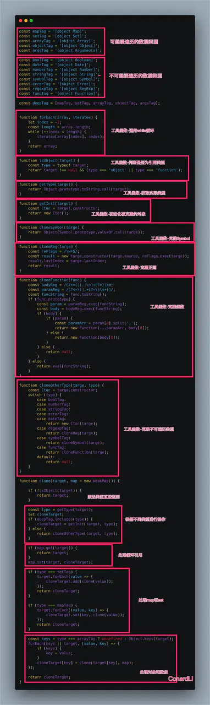

# js 进阶

## 内存泄漏的场景 ?
- 1. 全局变量引起
- 2. 闭包引起
- 3. DOM删除而事件未清除
- 4. 没关掉的计时器

## GC (Garbage Collection, 垃圾回收)机制
- 引用类型是在没有引用之后, 通过 v8 的 GC 自动回收, 
- 值类型如果是处于闭包的情况下, 要等闭包没有引用才会被 GC 回收, 非闭包的情况下等待 v8 的新生代 (new space) 切换的时候回收
[1](https://elemefe.github.io/node-interview/#/sections/zh-cn/common?id=%e5%86%85%e5%ad%98%e9%87%8a%e6%94%be)
[2](https://zhuanlan.zhihu.com/p/25736931)

## 防止内存泄漏
- ESLint 检测代码检查非期望的全局变量。
- 使用闭包的时候，避免写出复杂的闭包。
- 绑定事件的时候，一定得在恰当的时候清除事件。

## 实现一个深拷贝 ?
```js
const newObj = JSON.parse(JSON.stringify(oldObj));
```
缺点：
- 1.无法实现对函数 、RegExp等特殊对象的克隆
- 2.会抛弃对象的constructor,所有的构造函数会指向Object
- 3.对象有循环引用,会报错

```js
// 简化版
function deepCopy(o) {
    if (o instanceof Array) {
        var n = [];
        for (var i = 0; i < o.length; ++i) {
            n[i] = deepCopy(o[i]);
        }
        return n;
    } else if (o instanceof Function) {
        var n = new Function("return " + o.toString())();
        return n
    } else if (o instanceof Object) {
        var n = {}
        for (var i in o) {
            n[i] = deepCopy(o[i]);
        }
        return n;
    } else {
        return o;
    }
}
//考虑到了数组、对象、函数三种引用类型
```
还需考虑
- 对函数 、RegExp 、 Date 、 Map 、 Set 等特殊对象的处理
- 循环引用

升级版 [参考](https://github.com/xiaomuzhu/ElemeFE-node-interview/blob/master/JavaScript%E5%9F%BA%E7%A1%80/javascript%E5%AE%9E%E7%8E%B0%E6%B7%B1%E5%85%8B%E9%9A%86.md)

号称终极版



[参考](https://juejin.im/post/5d6aa4f96fb9a06b112ad5b1)

## 防抖与节流 ?
- 函数防抖(debounce) 
    - 在事件被触发n秒后再执行回调，如果在这n秒内又被触发，则重新计时。
- 函数节流(throttle) 
    - 规定在一个单位时间内，只能触发一次函数。如果这个单位时间内触发多次函数，只有一次生效。

- 不同:
    - 防抖是将多次执行变为最后一次执行，节流是将多次执行变为在规定时间内只执行一次.

- 应用场景:
    - debounce
        - search搜索联想，用户在不断输入值时，用防抖来节约请求资源
        - window触发resize的时候，不断的调整浏览器窗口大小会不断的触发这个事件，用防抖来让其只触发一次
    - throttle
        - 鼠标不断点击触发，mousedown(单位时间内只触发一次)
        - 监听滚动事件，比如是否滑到底部自动加载更多，用throttle来判断

防抖
```js
/* 
immediate:

非立即执行:，如果你在一个事件触发的n秒内又触发了这个事件，那我就以新的事件的时间为准，n 秒后才执行

立即执行：我不希望非要等到事件停止触发后才执行，我希望立刻执行函数，然后等到停止触发 n 秒后，才可以重新触发执行
*/
function debounce(fn, wait, immediate) {
    let timer;
    let debounced = function () {
        let context = this;
        let args = arguments;
        if (timer) {
            clearTimeout(timer);
        }
        let callNow = !timer;
        if (immediate) {
            // 已经执行过，不再执行  切换callNow状态
            timer = setTimeout(function () {
                timer = null;
            }, wait);
            if (callNow) {
                fn.apply(context, args);
            }
        } else {
            timer = setTimeout(function () {
                fn.apply(context, args);
            }, wait);
        }
    };

    // 取消方法
    debounced.cancel = function() {
        clearTimeout(timeout);
        timeout = null;
    }

    return debounced;
}
```

节流
```js
// 立即执行版：
function throttle(fn, wait) {
    let context,
        args;
    let previous = 0;  // 第一次 now - previous > wait 肯定true，立即执行
    return function() {
        let now = + new Date();
        context = this;
        args = arguments;
        if (now - previous > wait) {
            fn.apply(context, args);
            previous = now;
        }
    };
}
```

```js
// 非立即执行版
function throttle(fn, wait) {
    let timeout;
    return function() {
        let context = this;
        let args = arguments;  
        // timeout存在，说明时间还不够，返回
        if (timeout) { return false;  }
        timeout = setTimeout(function () { 
            fn.apply(context, args);
            // 切换timeout状态
            timeout = null;
        }, wait);
    };   
}
```

参考
[1](https://juejin.im/post/5c6bab91f265da2dd94c9f9e)
[2](https://juejin.im/post/6844903888978444296)


## toString 和 valueOf 区别
这两个方法主要用于对象的隐式转换。

当这两个方法同时存在时候，会** 先调用 valueOf ** ，若返回的不是原始类型，那么会调用 toString 方法，如果这时候 toString 方法返回的也不是原始数据类型，那么就会报错。

用 String 的拆箱转换会优先调用 toString。

```js
let o = {
    toString: () => {
        return 'my is o,'
    },
    valueOf: () => {
        return 99
    }
}
console.log(o + 'abc') // 99abc
console.log(o * 10) // 990
```

```js
let o = {
    // 返回引用类型
    toString: () => {
        console.log('into toString')
        return { 'string': 'ssss' }
    },
    valueOf: () => {
        console.log('into valueOf')
        return { 'val': 99 }
    }
}

console.log(o + 'xx')
//into valueOf
//into toString
//TypeError

String(o)
//into toString
//into valueOf
//TypeError
```

在 ES6 之后，还允许对象通过显式指定 @@toPrimitive Symbol 来覆盖原有的行为。
```js
let o = {
    [Symbol.toPrimitive]: () => {console.log("toPrimitive"); return "hello"}
};

o + "";
// toPrimitive 
// hello
```
[1](https://juejin.im/post/5cec1bcff265da1b8f1aa08f#heading-23)

## 私有变量实现
- 约定
- 闭包
- WeakMap
- Symbol
- Proxy
[1](https://juejin.im/post/5bf41990e51d4552ee424d2c)
[2](https://juejin.im/post/5a8e9b6d5188257a5f1ed826#heading-5)

## ECMAScript中所有函数的参数都是按值传递的。
[1](https://juejin.im/post/5902a37ca22b9d0065cc4f7a)

